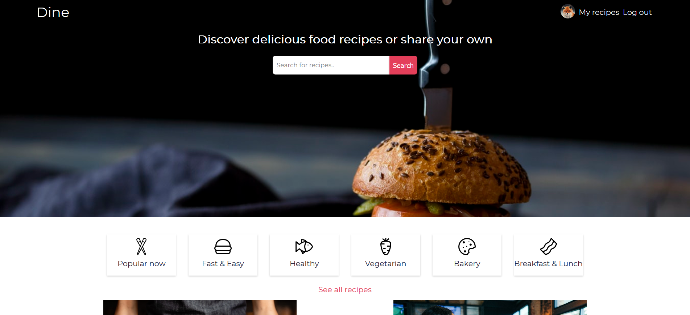
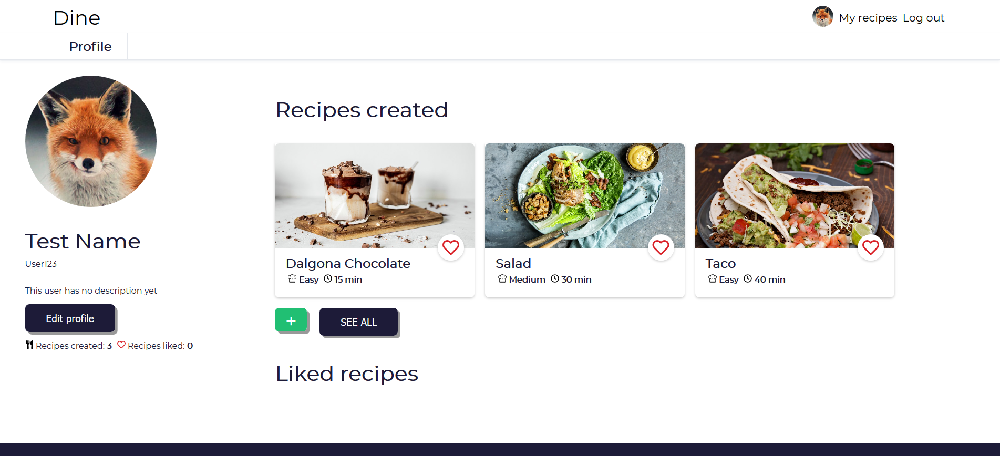

# Dine - Discover and share food recipes. 
Dine is a personal project where users are able to discover and share food recipes created by others. Signed in users have their own profile page, with an overview over created and liked recipes. 

The purpose of this project where to practice building webapplications with PHP, HTML, CSS & JavaScript. For this project I am using MySQL as the database.

## Design Preview

## User Profile Preview

## Todo
- [x] Homepage
- [x] Login
- [x] Registration with hashing and salt
- [x] Creating recipes
- [x] Viewing recipes
- [x] User Profile
- [x] Edit Profile
- [x] View other profiles
- [x] Like system
- [x] Image upload
- [x] Category part
- [x] Recipe cards
- [x] Responsive Design for all pages
- [ ] Edit and delete recipes
